# Core Terminology Flowchart

## Overview

This flowchart visualizes the relationships between core terminology categories in the Salesforce RAG knowledge library. Use this to understand how different terms relate to each other and navigate the glossary effectively.

## Terminology Relationships Flowchart

```mermaid
graph TB
    %% Integration Layer
    subgraph Integration["Integration Patterns"]
        ETL[ETL<br/>Batch Sync]
        API[API<br/>Synchronous]
        Events[Platform Events<br/>Asynchronous]
        ExternalID[External ID<br/>Record Mapping]
        IntegrationKey[Integration Key<br/>Composite Keys]
    end

    %% Integration Platforms
    subgraph Platforms["Integration Platforms"]
        MuleSoft[MuleSoft<br/>Security Boundary]
        Boomi[Dell Boomi<br/>High-Volume ETL]
        BulkAPI[Bulk API<br/>Large Data Sets]
        CDC[Change Data Capture<br/>Real-time Changes]
    end

    %% Identity Layer
    subgraph Identity["Identity & SSO"]
        OIDC[OIDC<br/>External Users]
        SAML[SAML<br/>Enterprise SSO]
        OrgTenant[Organization Tenant<br/>Partner Identity]
        LoginHandler[Login Handler<br/>Routing Logic]
    end

    %% Data Model Layer
    subgraph DataModel["Data Modeling"]
        SIS[SIS<br/>Student System]
        EDA[EDA<br/>Education Cloud]
        RecordType[Record Type<br/>Record Differentiation]
        Idempotent[Idempotent Operation<br/>Safe Retries]
        Reconciliation[Reconciliation<br/>Data Consistency]
    end

    %% Security Layer
    subgraph Security["Security & Access"]
        PermissionSet[Permission Set<br/>Incremental Permissions]
        PermissionSetGroup[Permission Set Group<br/>Role-Based Assignment]
        SharingSet[Sharing Set<br/>Portal Visibility]
        OWD[Org-Wide Defaults<br/>Baseline Access]
        SharingRules[Sharing Rules<br/>Extended Access]
        ApexSharing[Apex Managed Sharing<br/>Programmatic Sharing]
    end

    %% Platform Layer
    subgraph Platform["Salesforce Platform"]
        ExperienceCloud[Experience Cloud<br/>Portal Platform]
        GovCloud[GovCloud<br/>Compliant Environment]
    end

    %% Development Layer
    subgraph Development["Development"]
        Apex[Apex<br/>Custom Logic]
        Flow[Flow<br/>Declarative Automation]
        LWC[LWC<br/>UI Components]
        OmniStudio[OmniStudio<br/>Guided Workflows]
        GovernorLimits[Governor Limits<br/>Resource Constraints]
        SelectiveQuery[Selective Query<br/>Indexed Queries]
        Locking[UNABLE_TO_LOCK_ROW<br/>Concurrency]
        ExponentialBackoff[Exponential Backoff<br/>Retry Strategy]
    end

    %% Data Quality Layer
    subgraph DataQuality["Data Quality"]
        Survivorship[Survivorship Rules<br/>Merge Logic]
        MasterData[Master Data Governance<br/>Data Stewardship]
    end

    %% Operations Layer
    subgraph Operations["Operations"]
        CICD[CI/CD<br/>Automated Deployment]
        SourceTracked[Source-Tracked Org<br/>Bidirectional Sync]
        UnlockedPackage[Unlocked Package<br/>Modular Components]
        CAB[Change Advisory Board<br/>Release Governance]
    end

    %% Observability Layer
    subgraph Observability["Observability"]
        LDV[Large Data Volume<br/>1M+ Records]
        RTO[Recovery Time Objective<br/>Downtime Target]
        RPO[Recovery Point Objective<br/>Data Loss Target]
        CircuitBreaker[Circuit Breaker<br/>Failover Pattern]
    end

    %% Data Governance Layer
    subgraph DataGov["Data Governance"]
        PII[PII<br/>Personally Identifiable]
        PHI[PHI<br/>Protected Health Info]
        GDPR[GDPR<br/>EU Regulation]
        CCPA[CCPA<br/>California Law]
        SOC2[SOC2<br/>Security Framework]
        Shield[Shield Encryption<br/>Data at Rest]
    end

    %% LLM/RAG Layer
    subgraph LLMRAG["LLM & RAG"]
        RAG[RAG<br/>Retrieval-Augmented Generation]
        LLM[LLM<br/>Large Language Model]
        Chunking[Chunking<br/>Data Segmentation]
        VectorDB[Vector Database<br/>Embedding Storage]
    end

    %% Adoption Layer
    subgraph Adoption["Adoption"]
        FeatureAdoption[Feature Adoption Telemetry<br/>Usage Metrics]
        TechnicalDebt[Technical Debt<br/>Remediation Needs]
        BaselineAudit[Baseline Audit<br/>Org Health]
    end

    %% Project Methods Layer
    subgraph ProjectMethods["Project Methods"]
        SprintDelivery[Sprint-Based Delivery<br/>Agile Framework]
        UAT[UAT<br/>User Acceptance Testing]
    end

    %% Relationships - Integration to Platforms
    ETL --> MuleSoft
    ETL --> Boomi
    ETL --> BulkAPI
    API --> MuleSoft
    Events --> CDC
    ExternalID --> Idempotent
    IntegrationKey --> ExternalID

    %% Relationships - Integration to Data Model
    ETL --> SIS
    ExternalID --> Reconciliation
    Idempotent --> Reconciliation

    %% Relationships - Identity to Platform
    OIDC --> ExperienceCloud
    SAML --> ExperienceCloud
    OrgTenant --> ExperienceCloud
    LoginHandler --> OIDC
    LoginHandler --> SAML
    LoginHandler --> OrgTenant

    %% Relationships - Identity to Data Model
    LoginHandler --> RecordType
    OIDC --> RecordType
    SAML --> RecordType
    OrgTenant --> RecordType

    %% Relationships - Data Model
    SIS --> EDA
    RecordType --> SharingSet

    %% Relationships - Security
    PermissionSet --> PermissionSetGroup
    OWD --> SharingRules
    SharingRules --> ApexSharing
    SharingSet --> ExperienceCloud
    PermissionSet --> ExperienceCloud

    %% Relationships - Development
    Apex --> GovernorLimits
    Flow --> GovernorLimits
    LWC --> Apex
    Flow --> Apex
    SelectiveQuery --> GovernorLimits
    Locking --> ExponentialBackoff
    Apex --> Locking
    Flow --> Locking

    %% Relationships - Operations
    CICD --> SourceTracked
    CICD --> UnlockedPackage
    CAB --> CICD

    %% Relationships - Observability
    LDV --> SelectiveQuery
    CircuitBreaker --> RTO
    CircuitBreaker --> RPO

    %% Relationships - Data Governance
    PII --> GDPR
    PII --> CCPA
    PHI --> Shield
    PII --> Shield
    GDPR --> Shield
    CCPA --> Shield
    SOC2 --> Shield

    %% Relationships - LLM/RAG
    RAG --> LLM
    RAG --> Chunking
    Chunking --> VectorDB
    CDC --> RAG
    BulkAPI --> RAG

    %% Relationships - Adoption
    FeatureAdoption --> BaselineAudit
    TechnicalDebt --> BaselineAudit

    %% Styling
    classDef integration fill:#e1f5ff,stroke:#01579b,stroke-width:2px
    classDef platform fill:#f3e5f5,stroke:#4a148c,stroke-width:2px
    classDef identity fill:#e8f5e9,stroke:#1b5e20,stroke-width:2px
    classDef data fill:#fff3e0,stroke:#e65100,stroke-width:2px
    classDef security fill:#ffebee,stroke:#b71c1c,stroke-width:2px
    classDef dev fill:#e0f2f1,stroke:#004d40,stroke-width:2px
    classDef ops fill:#f1f8e9,stroke:#33691e,stroke-width:2px
    classDef gov fill:#fce4ec,stroke:#880e4f,stroke-width:2px

    class ETL,API,Events,ExternalID,IntegrationKey integration
    class MuleSoft,Boomi,BulkAPI,CDC platform
    class OIDC,SAML,OrgTenant,LoginHandler identity
    class SIS,EDA,RecordType,Idempotent,Reconciliation data
    class PermissionSet,PermissionSetGroup,SharingSet,OWD,SharingRules,ApexSharing security
    class Apex,Flow,LWC,OmniStudio,GovernorLimits,SelectiveQuery,Locking,ExponentialBackoff dev
    class CICD,SourceTracked,UnlockedPackage,CAB,LDV,RTO,RPO,CircuitBreaker ops
    class PII,PHI,GDPR,CCPA,SOC2,Shield gov
```

## Category Navigation

### Integration Patterns
- **ETL**: High-volume batch synchronization
- **API**: Synchronous request/response
- **Platform Events**: Asynchronous publish-subscribe
- **External ID**: Stable record mapping
- **Integration Key**: Composite identifiers

### Integration Platforms
- **MuleSoft**: Security boundary and transformation
- **Dell Boomi**: High-volume ETL operations
- **Bulk API**: Large-scale data operations
- **CDC**: Real-time change notifications

### Identity & SSO
- **OIDC**: External user authentication
- **SAML**: Enterprise SSO
- **Organization Tenant**: Partner identity
- **Login Handler**: Identity routing logic

### Data Modeling
- **SIS**: Student Information System
- **EDA**: Education Data Architecture
- **Record Type**: Record differentiation
- **Idempotent Operation**: Safe retry patterns
- **Reconciliation**: Data consistency

### Security & Access
- **Permission Set**: Incremental permissions
- **Permission Set Group**: Role-based assignment
- **Sharing Set**: Portal visibility rules
- **Org-Wide Defaults**: Baseline access
- **Sharing Rules**: Extended access
- **Apex Managed Sharing**: Programmatic sharing

### Development
- **Apex**: Custom business logic
- **Flow**: Declarative automation
- **LWC**: Lightning Web Components
- **OmniStudio**: Guided workflows
- **Governor Limits**: Resource constraints
- **Selective Query**: Indexed queries
- **UNABLE_TO_LOCK_ROW**: Concurrency issues
- **Exponential Backoff**: Retry strategies

### Operations
- **CI/CD**: Automated deployment
- **Source-Tracked Org**: Bidirectional sync
- **Unlocked Package**: Modular components
- **CAB**: Change Advisory Board
- **LDV**: Large Data Volume handling
- **RTO/RPO**: Disaster recovery objectives
- **Circuit Breaker**: Failover patterns

### Data Governance
- **PII/PHI**: Sensitive data types
- **GDPR/CCPA**: Compliance regulations
- **SOC2**: Security framework
- **Shield Encryption**: Data protection

### LLM & RAG
- **RAG**: Retrieval-Augmented Generation
- **LLM**: Large Language Model
- **Chunking**: Data segmentation
- **Vector Database**: Embedding storage

### Adoption
- **Feature Adoption Telemetry**: Usage tracking
- **Technical Debt**: Remediation needs
- **Baseline Audit**: Org health assessment

### Project Methods
- **Sprint-Based Delivery**: Agile framework
- **UAT**: User Acceptance Testing

## How to Use This Flowchart

1. **Start with a term**: Find the term you're looking for in the flowchart
2. **Follow relationships**: Arrows show how terms relate to each other
3. **Explore categories**: Each colored section represents a domain
4. **Navigate to glossary**: Use the term to find detailed definitions in `core-terminology.md`
5. **Find patterns**: Related patterns are documented in the RAG knowledge library

## Related Documentation

- **[Core Terminology](core-terminology.md)**: Complete glossary with definitions
- **[RAG Index](../rag-index.md)**: Index of all knowledge files
- **[README](../../README.md)**: Repository overview and usage guide

